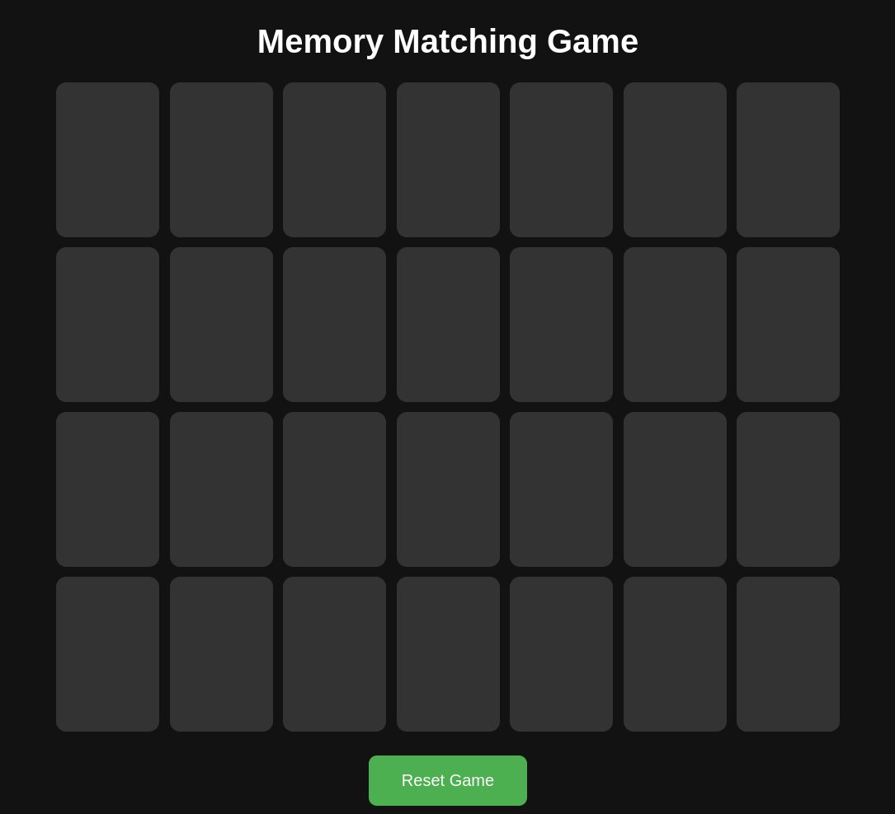
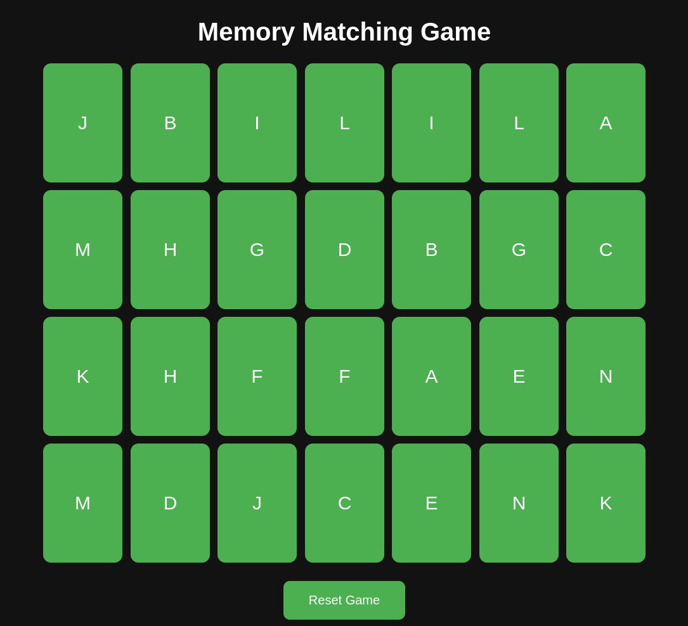
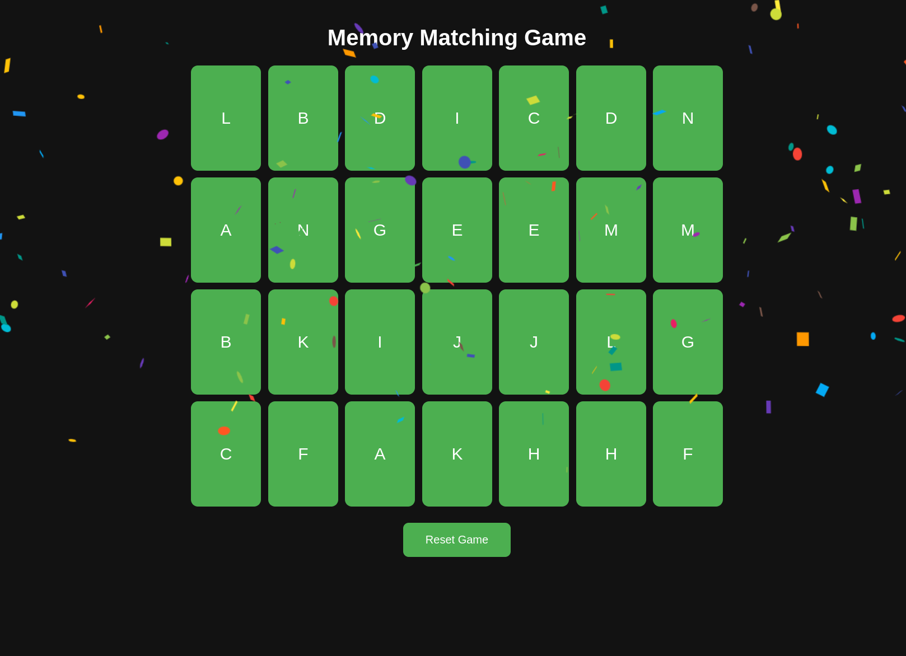

# Memory Matching Game



Welcome to the Memory Matching Game! This is a fun and interactive card game built using React. The goal of the game is to match pairs of cards by flipping them over. When all pairs are matched, you win, and a celebratory confetti animation is displayed!

## Features

- **Dark Mode:** The game uses a sleek dark theme by default.
- **Confetti Celebration:** Enjoy a confetti animation when you successfully match all pairs.

## Gameplay

1. **Objective:** Match all pairs of cards on the board.
2. **Start of Game:** Cards are shown briefly at the start, then flipped face down.
3. **Flipping Cards:** Click on a card to flip it over. You can flip two cards at a time.
4. **Matching:** If the two flipped cards match, they remain face up. Otherwise, they flip back over.
5. **Winning:** Once all cards are matched, you win the game!

## Pre-Game

You get 3 seconds at the beginning of the game to remember the board!



### Winning Screen



## Installation and Setup

1. **Clone the Repository:**

    ```bash
    git clone https://github.com/yourusername/memory-matching-game.git
    cd memory-matching-game
    ```

2. **Install dependencies**
Ensure you have Node.js and npm installed, then run:
    ```bash
    npm install
    ```

3. **Run the development server***
Start the development server with:
    ```bash
    npm start
    ```
This will open the game in your default web browser at `http://localhost:3000`


# Project Structure
- src/App.js: Main application component that sets up the game board and handles state management.
- src/components/Board.js: Manages the game logic and card matching.
- src/components/Card.js: Represents individual cards in the game.
- src/styles.css: Contains styles for the game, including dark mode and matched card styles.

# Technologies Used
- **React**: A JavaScript library for building user interfaces.
- **CSS**: Used for styling the game components.

# Future Improvements
- **Add Timer**: Implement a timer to challenge players to complete the game quickly.
- **Score System**: Introduce a scoring system based on the number of moves made.
- **Sound Effects**: Add sound effects for flipping cards and winning.